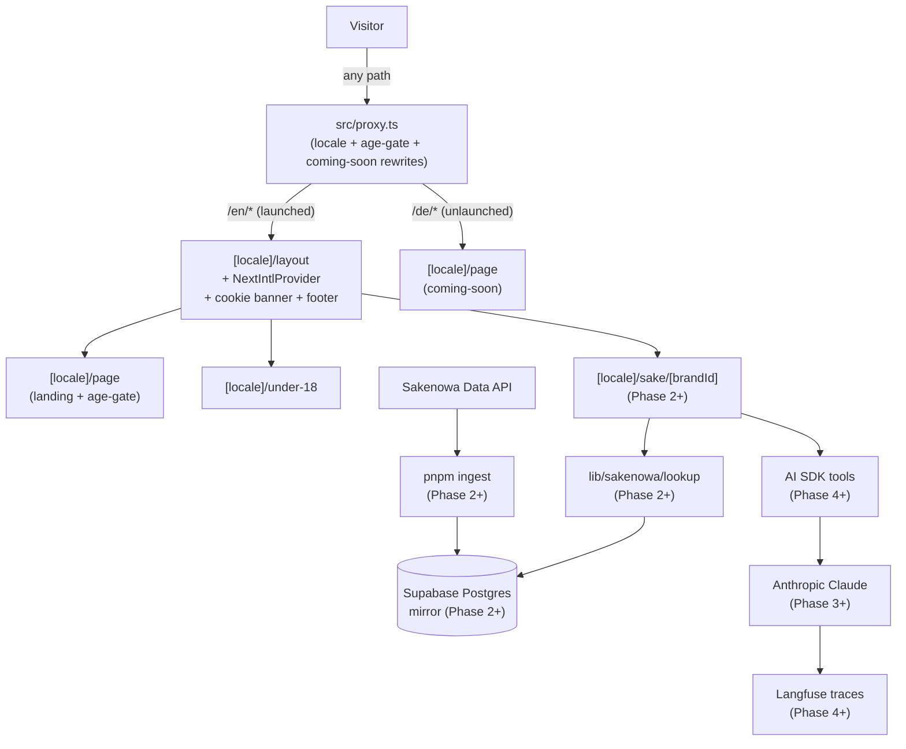

# Yawaragi 和らぎ

[](https://github.com/yawaragi-dev/yawaragi/actions/workflows/ci.yml)

A sake companion. Three flagship surfaces: **label scan**, **chat recommender**, **taste profile**.

**Live:** <https://yawaragi.dev> — English preview is live. German edition is intentionally on a coming-soon page until the Impressum (§5 DDG) is in place; see [ADR-0008](./docs/adr/0008-en-first-launch-strategy.md).

> *Yawaragi-mizu* (和らぎ水) is the water drunk between sake sips — a palate reset, not a replacement. This app accompanies and clarifies; it doesn't compete with the sake.

Previously named "Kanpai"; renamed to avoid collision with [KANPAI London Craft Sake Brewery](https://kanpai.london/). Decision and rationale in [`docs/adr/0004-project-name-yawaragi.md`](./docs/adr/0004-project-name-yawaragi.md). Full naming research: [`docs/NAMING-RESEARCH.md`](./docs/NAMING-RESEARCH.md).

## Stack

- Next.js 16 (App Router, RSC by default) · TypeScript strict · Tailwind + shadcn/ui
- Vercel AI SDK 6 for LLM work · `@ai-sdk/mcp` connecting to our own MCP server
- Supabase (Postgres) · Clerk (auth) · Langfuse Cloud (tracing)
- Vitest + happy-dom (unit) · Playwright (E2E + async RSC)
- pnpm

## Architecture



Phase 0 (i18n + legal scaffolding + EN-first launch) is shipped. Phase 2+ nodes are placeholders for the data foundation, label scan, chat, and taste profile slices that compose with the Phase 0 surface unchanged.

## Getting started

### Prerequisites

- **Node 22+** and **pnpm 11.1.2** (the `packageManager` field pins it for `corepack enable`)
- **Docker** with a daemon reachable on the default socket (or `DOCKER_HOST` set) — required by `pnpm test:integration` / `pnpm verify`. On Linux, after installing Docker Engine, add your user to the `docker` group (`sudo usermod -aG docker $USER` then re-login). Docker Desktop, Colima, OrbStack, and rootless Docker all work; testcontainers auto-detects.

### First-run

```bash
pnpm install
cp .env.example .env.local   # fill in API keys
docker pull postgres:16-alpine   # one-time; the integration runner reuses this image
pnpm dev
```

## Commands

| Command                   | Purpose                                                  |
|---------------------------|----------------------------------------------------------|
| `pnpm dev`                | Next dev server                                          |
| `pnpm test`               | Vitest unit suite, single run                            |
| `pnpm test:watch`         | Vitest watch mode                                        |
| `pnpm test:integration`   | Vitest integration suite (testcontainers; needs Docker)  |
| `pnpm test:e2e`           | Playwright                                               |
| `pnpm lint`               | ESLint                                                   |
| `pnpm typecheck`          | `tsc --noEmit`                                           |
| `pnpm migrate`            | Apply pending SQL files in `supabase/migrations/`        |
| `pnpm ingest`             | Refresh Sakenowa data into Supabase                      |
| `pnpm verify`             | Full chain (lint + typecheck + test + integration + e2e + audits) — **needs Docker** |
| `pnpm eval`               | Run eval golden sets                                     |

## Project documentation

- [`CLAUDE.md`](./CLAUDE.md) — agent operating instructions, conventions, anti-patterns
- [`CONTEXT.md`](./CONTEXT.md) — domain glossary; read before naming variables/types
- [`docs/adr/`](./docs/adr) — architecture decision records
- [`docs/PRE-GO-LIVE.md`](./docs/PRE-GO-LIVE.md) — hard gates before any public launch
- [`docs/deploying.md`](./docs/deploying.md) — Vercel deployment, env vars, vendor DPAs, plan-tier audit
- [`docs/NAMING-RESEARCH.md`](./docs/NAMING-RESEARCH.md) — naming decision rationale

## Open-source

The MCP server that exposes the Sakenowa-mirrored sake catalogue lives in its own repo at [`yawaragi-dev/sakenowa-mcp`](https://github.com/yawaragi-dev/sakenowa-mcp) and is consumed by this app as the npm package **`@yawaragi/sakenowa-mcp`** (v0.0.1 stub published; full implementation in Phase 4). It deliberately depends on neither Next.js nor Clerk nor any Yawaragi-specific logic, so anyone with a Sakenowa mirror in Postgres can run it standalone. See [`docs/adr/0003-mcp-server-extractability.md`](./docs/adr/0003-mcp-server-extractability.md).

## Attribution

Sake data is sourced from the [Sakenowa Data API](https://muro.sakenowa.com/sakenowa-data/api/). "Flavor Chart" is a registered trademark of Sakenowa.

## Licence

Open-core. Application code is All Rights Reserved; the cross-beverage map (CC BY-NC-SA 4.0), the glossary (CC BY-SA 4.0), and the Zod schemas (MIT) are permissively licensed. See [`docs/LICENSE-STRATEGY.md`](./docs/LICENSE-STRATEGY.md) and [`LICENSE`](./LICENSE).

The MCP server [`@yawaragi/sakenowa-mcp`](https://github.com/yawaragi-dev/sakenowa-mcp) lives in its own repo and is MIT-licensed.
