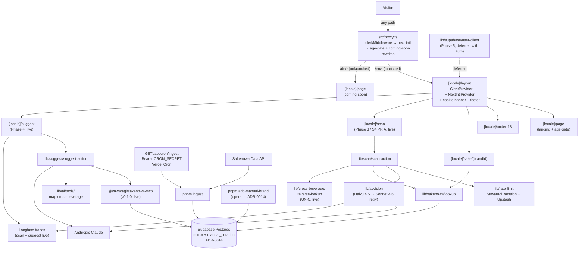

# Yawaragi 和らぎ

[](https://github.com/yawaragi-dev/yawaragi/actions/workflows/ci.yml)

A sake companion. Three flagship surfaces: **label scan**, **chat recommender**, **taste profile**.

**Live:** <https://yawaragi.dev> — English preview is live. German edition is intentionally on a coming-soon page until the Impressum (§5 DDG) is in place; see [ADR-0008](./docs/adr/0008-en-first-launch-strategy.md).

<!-- progress:start -->

## Milestone progress

_Snapshot generated 2026-07-07 from GitHub Issues + merged PRs. Regenerate with `pnpm progress`. Detail: [docs/PROGRESS.md](./docs/PROGRESS.md)._

| Milestone | Progress | Issues | ETA (median) |
| --- | --- | --- | --- |
| **M1 (Phase 0) — Compliance & i18n foundation** | `████████████████████` 100% | 5 / 5 | done |
| **M2 (Phase 2) — Data foundation** | `███████████████████░` 94% | 11 / 12 | 2026-07-08 |
| **M3 (Phases 3–5) — Flagship surfaces** | `████████████████░░░░` 82% | 9 / 11 | 2026-07-09 |

<!-- progress:end -->

> *Yawaragi-mizu* (和らぎ水) is the water drunk between sake sips — a palate reset, not a replacement. This app accompanies and clarifies; it doesn't compete with the sake.

Previously named "Kanpai"; renamed to avoid collision with [KANPAI London Craft Sake Brewery](https://kanpai.london/). Decision and rationale in [`docs/adr/0004-project-name-yawaragi.md`](./docs/adr/0004-project-name-yawaragi.md). Full naming research: [`docs/NAMING-RESEARCH.md`](./docs/NAMING-RESEARCH.md).

## Stack

- Next.js 16 (App Router, RSC by default) · TypeScript strict · Tailwind + shadcn/ui
- Vercel AI SDK 6 for LLM work · `@ai-sdk/mcp` connecting to our own MCP server
- Supabase (Postgres) · Clerk (auth) · Langfuse Cloud (tracing)
- Vitest + happy-dom (unit) · Playwright (E2E + async RSC)
- pnpm

## Architecture



Phase 0 (i18n + legal scaffolding + EN-first launch) and Phase 2 (data foundation, Sakenowa mirror, scheduled cron ingest, provenance schemas) are shipped. **Phase 3 (anonymous label scan)** is in flight — see the milestone bar above for the live status. The entry page + canvas downscale + Sakenowa lookup chain (S1), the anonymous-session rate limit (S2), the Anthropic vision provider (S3), the three-tier confidence UX + two-tier vision retry + manual-curation layer (S4 PR A), the in-place result card on `/scan` (UX-B, ADR-0015 — a confident match renders photo + kanji + flavor chart + deep-link in place, replacing the earlier auto-redirect), and the reverse cross-beverage exemplar layer on the scan card (UX-C — "interesting for those who like Lagavulin 16" via a 62-row hand-curated exemplar table + deterministic L2 lookup, with a `no-close-analog` sentinel for sakes that legitimately have no Western analog) are all live. The remaining S4 work (PR B — enriched disambiguation list, no-match enrichment, "Not this one?" affordance, full Playwright matrix) and the eval harness (S5) are the open slices. Two-tier vision means Haiku 4.5 runs every scan; Sonnet 4.6 retries on any tier-1 result other than a clean first-pass match, recovering the calligraphic-kanji and field-swap cases at ~6× cost only on those bottles. The manual-curation layer (ADR-0014) lets the maintainer add brands missing from Sakenowa's frozen public dump (`pnpm add-manual-brand` — UMAMI is the seed). **Phase 4 (single-shot suggestions over MCP + cross-beverage)** is shipped: the `/[locale]/suggest` surface takes a `?seed=<brandId>` from the sake detail page's "Find similar" link OR a freeform text query, runs a single AI SDK tool loop with the Sakenowa MCP tools + the deterministic `mapCrossBeverage` cross-beverage bridge, and returns a per-field-provenance card list with inline `<HeuristicDisclaimer />` on cross-beverage results. Every call is Langfuse-traced; the `evals/suggest-jp/` harness (`pnpm eval suggest-jp`) runs 15 seed queries with ground-truth recall@k. See PRD [#138](https://github.com/yawaragi-dev/yawaragi/issues/138). **Phase 5 (taste profile, ratings)** is deferred along with auth resumption. Every Phase 3+ surface is designed to survive being wrapped in a native webview shell per [ADR-0012](./docs/adr/0012-webview-able-architecture.md).

## Getting started

### Prerequisites

- **Node 22+** and **pnpm 11.1.2** (the `packageManager` field pins it for `corepack enable`)
- **Docker** with a daemon reachable on the default socket (or `DOCKER_HOST` set) — required by `pnpm test:integration` / `pnpm verify`. On Linux, after installing Docker Engine, add your user to the `docker` group (`sudo usermod -aG docker $USER` then re-login). Docker Desktop, Colima, OrbStack, and rootless Docker all work; testcontainers auto-detects.

### First-run

```bash
pnpm install
cp .env.example .env.local   # fill in API keys
docker pull postgres:16-alpine   # one-time; the integration runner reuses this image
pnpm dev
```

## Commands

| Command                   | Purpose                                                  |
|---------------------------|----------------------------------------------------------|
| `pnpm dev`                | Next dev server                                          |
| `pnpm test`               | Vitest unit suite, single run                            |
| `pnpm test:watch`         | Vitest watch mode                                        |
| `pnpm test:integration`   | Vitest integration suite (testcontainers; needs Docker)  |
| `pnpm test:e2e`           | Playwright                                               |
| `pnpm lint`               | ESLint                                                   |
| `pnpm typecheck`          | `tsc --noEmit`                                           |
| `pnpm migrate`            | Apply pending SQL files in `supabase/migrations/`        |
| `pnpm ingest`             | Refresh Sakenowa data into Supabase                      |
| `pnpm rate-limit:reset`   | Wipe `rl:*` keys in Upstash so the next scan starts at 5/5 (maintainer testing) |
| `pnpm db:resync`          | One-shot: `db:reset --yes && migrate && ingest`          |
| `pnpm verify`             | Full chain (lint + typecheck + test + integration + e2e + audits) — **needs Docker** |
| `pnpm eval <suite>`       | Run an eval suite (`suggest-jp` today). Informational — needs a dev server up. See `evals/<suite>/README.md`. |
| `pnpm progress`           | Refresh the milestone-progress dashboard (README block + `docs/PROGRESS.md`) |

## Project documentation

- [`CLAUDE.md`](./CLAUDE.md) — agent operating instructions, conventions, anti-patterns
- [`CONTEXT.md`](./CONTEXT.md) — domain glossary; read before naming variables/types
- [`docs/adr/`](./docs/adr) — architecture decision records
- [`docs/PRE-GO-LIVE.md`](./docs/PRE-GO-LIVE.md) — hard gates before any public launch
- [`docs/PROGRESS.md`](./docs/PROGRESS.md) — milestone-progress dashboard with ETAs, methodology, and what is NOT measured
- [`docs/deploying.md`](./docs/deploying.md) — Vercel deployment, env vars, vendor DPAs, plan-tier audit
- [`docs/NAMING-RESEARCH.md`](./docs/NAMING-RESEARCH.md) — naming decision rationale

## Open-source

The MCP server that exposes the Sakenowa-mirrored sake catalogue lives in its own repo at [`yawaragi-dev/sakenowa-mcp`](https://github.com/yawaragi-dev/sakenowa-mcp) and is consumed by this app as the npm package **`@yawaragi/sakenowa-mcp`**. v0.0.1 reserves the npm name; **v0.1.0 is in development** — six read-only tools over the Sakenowa schema, per the [spec doc](https://github.com/yawaragi-dev/sakenowa-mcp/blob/main/docs/specs/v0.1.0.md) and [issue tree](https://github.com/yawaragi-dev/sakenowa-mcp/issues). The server deliberately depends on neither Next.js nor Clerk nor any Yawaragi-specific logic, so anyone with a Sakenowa mirror in Postgres can run it standalone. See [`docs/adr/0003-mcp-server-extractability.md`](./docs/adr/0003-mcp-server-extractability.md).

## Attribution

Sake data is sourced from the [Sakenowa Data API](https://muro.sakenowa.com/sakenowa-data/api/). "Flavor Chart" is a registered trademark of Sakenowa.

## Licence

Open-core. Application code is All Rights Reserved; the cross-beverage map (CC BY-NC-SA 4.0), the glossary (CC BY-SA 4.0), and the Zod schemas (MIT) are permissively licensed. See [`docs/LICENSE-STRATEGY.md`](./docs/LICENSE-STRATEGY.md) and [`LICENSE`](./LICENSE).

The MCP server [`@yawaragi/sakenowa-mcp`](https://github.com/yawaragi-dev/sakenowa-mcp) lives in its own repo and is MIT-licensed.
